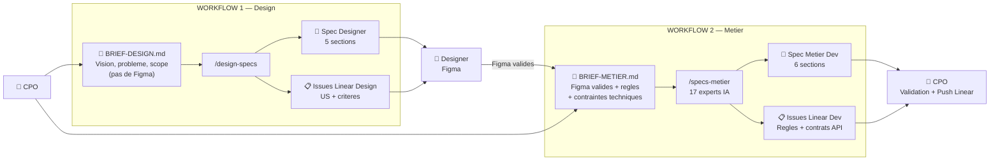
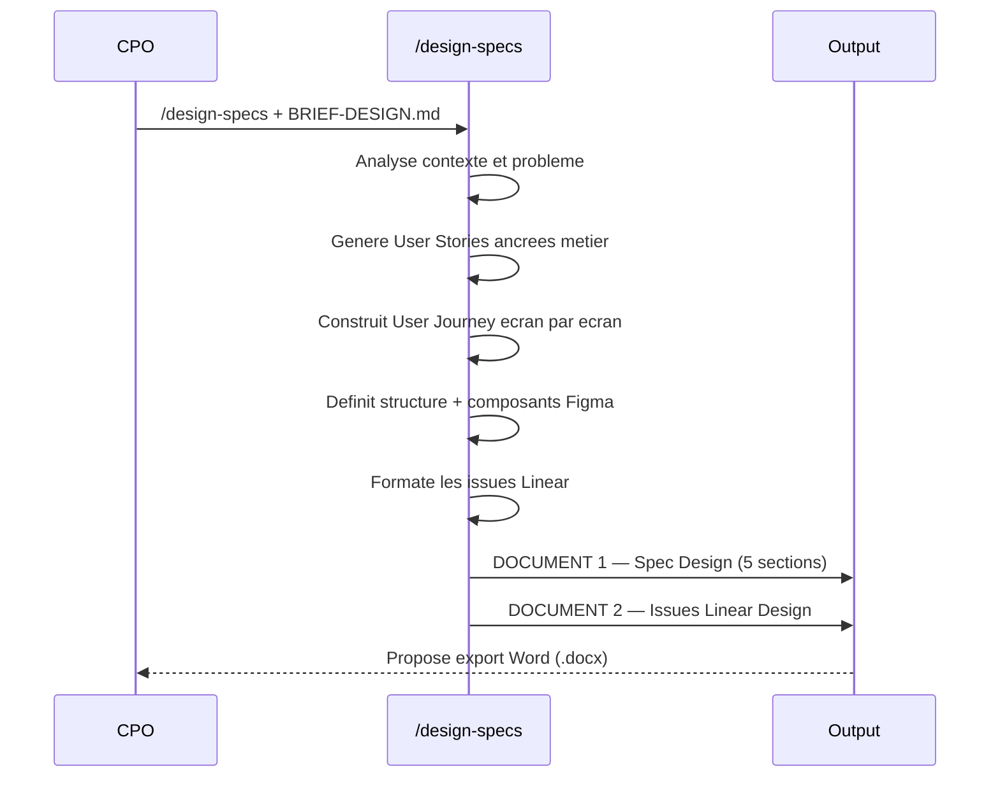
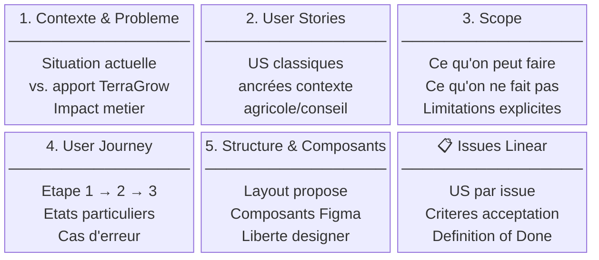
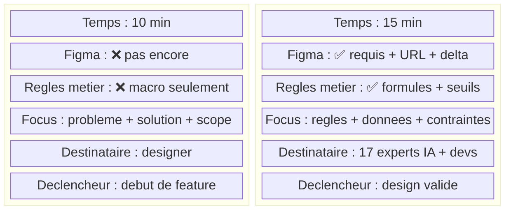
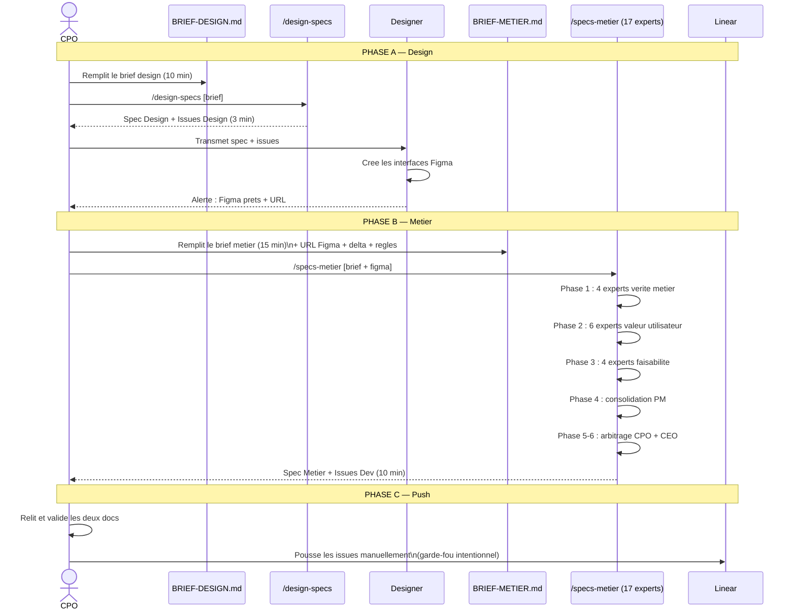

# Global Product Workflow — TerraGrow

> **Un systeme de specification produit de niveau industriel.**
> Du brief CPO aux issues Linear — deux workflows distincts, 17 experts IA, zero ambiguite.

---

## Vue d'ensemble

`global-product-workflow` automatise la production de specifications produit chez TerraGrow. Il transforme un brief CPO en deux livrables actionnables : une **spec designer** et une **spec metier developpeur**, chacune accompagnee d'issues Linear structurees et pret-a-pousser.

```
BRIEF-DESIGN.md  →  /design-specs  →  Spec Designer  +  Issues Design   (3 min)
BRIEF-METIER.md  →  /specs-metier  →  Spec Dev       +  Issues Dev       (10 min)
```

Deux briefs distincts. Deux skills distincts. Deux specs distinctes. Un seul systeme.

---

## Les deux workflows

### Vue macro



---

## Workflow 1 — Design (`/design-specs`)

> **Quand ?** Le design n'existe pas encore. Le CPO donne sa vision au designer.
> **Input :** `BRIEF-DESIGN.md` — 10 min a remplir, pas de Figma, pas de regles metier.

### Ce que contient `BRIEF-DESIGN.md`

```
Nom + date + version cible
Probleme actuel           → workflow concret, temps perdu, frustration mesurable
Solution souhaitee        → 2-4 phrases, ce que l'utilisateur va pouvoir faire
Utilisateur               → role + frequence + contexte d'usage
Ce qu'on peut faire       → actions possibles (max 8, verbe + objet)
Ce qu'on ne fait pas      → hors scope + raisons explicites
Donnees disponibles       → ce qu'on a dans TerraGrow vs. ce qui manque
Questions ouvertes        → zones d'incertitude pour le skill
Inspiration (optionnel)   → references visuelles
```

### Sequence d'execution



### Output : Spec Design — 5 sections



---

## Workflow 2 — Metier (`/specs-metier`)

> **Quand ?** Le design est valide. Le CPO briefe les 17 experts avec le Figma et les contraintes.
> **Input :** `BRIEF-METIER.md` — 15 min, necessite les Figma valides + regles metier connues.

### Ce que contient `BRIEF-METIER.md`

```
Nom + date + reference au brief design
Figma              → URL + liste des screens + delta vs brief design initial
Utilisateur        → role + impact metier attendu (mesurable)
Regles metier      → formules, seuils, regles domaine agricole (ce qu'on sait)
Perimetre          → ce qu'on implemente + hors scope confirme
Donnees            → entites en base + sources externes + modules TerraGrow
Contraintes        → performances, compatibilite, calendaire
Questions ouvertes → ce que les experts doivent trancher
Decisions prises   → ce qui est arrete, ne pas remettre en question
```

### Les 17 experts — 5 phases

```mermaid
flowchart TD
    IN["📄 BRIEF-METIER.md\n+ Figma valides"]

    subgraph P1["Phase 1 — Verite metier  ●●●●○○○○○○"]
        direction LR
        E1["🌾 agricultural-management-expert\nLogique de pilotage, indicateurs"]
        E2["📊 agricultural-accounting-expert\nCoherence comptable, comptes ANC"]
        E3["🌱 agronomy-expert\nIndicateurs agronomiques, unites"]
        E4["💶 agricultural-techno-economic-expert\nCouts, marges, BFR, rentabilite"]
    end

    subgraph P2["Phase 2 — Valeur utilisateur  ●●●●●●○○○○"]
        direction LR
        E5["🔭 future-farm-advisor\nConseil proactif, workflows futurs"]
        E6["🛡️ conservative-farm-advisor\nFrictions adoption, contraintes cabinet"]
        E7["🌾 large-crop-farmer-persona\nGrandes cultures, lisibilite"]
        E8["🍷 viticulture-farmer-persona\nViticulture, saisonnalite"]
        E9["🐄 mixed-farming-livestock-persona\nPolyculture-elevage, complexite"]
        E10["🖥️ uiux-expert\nCoherence interface / logique produit"]
    end

    subgraph P3["Phase 3 — Faisabilite technique  ●●●●●●●●○○"]
        direction LR
        E11["🗄️ terragrow-database-architect\nModele de donnees, persistance"]
        E12["⚙️ terragrow-developer-reviewer\nImplementation, contrats API"]
        E13["🔗 integration-qa-expert\nDependances, regression, testabilite"]
        E14["📈 product-analytics-expert\nMetriques succes, events, signaux"]
    end

    subgraph P4["Phase 4 — Consolidation  ●●●●●●●●●○"]
        E15["📝 pm-spec-orchestrator\nFusion editoriale, contradictions"]
    end

    subgraph P5["Phase 5-6 — Arbitrage  ●●●●●●●●●●"]
        E16["⚖️ cpo-scope-arbiter\nScope, must-have vs. futur — obligatoire"]
        E17["🎯 ceo-strategic-validator\nValidation strategique — conditionnel"]
    end

    OUT1["📐 Spec Metier Dev\n6 sections"]
    OUT2["📋 Issues Linear Dev\nRegles + contrats API"]

    IN --> P1
    P1 --> P2
    P2 --> P3
    P3 --> P4
    P4 --> P5
    P5 --> OUT1
    P5 --> OUT2
```



### Output : Spec Metier — 6 sections

| # | Section | Contenu | Pour qui |
|---|---|---|---|
| 1 | Contexte & Vision | Probleme, solution, impact attendu | Dev + CPO |
| 2 | User Stories | US avec contexte metier agricole + priorite | Dev |
| 3 | Regles metier | Formules, seuils, contraintes validees par les experts | Dev |
| 4 | Ce qu'on fait / ne fait pas | Scope technique + hypotheses critiques | Dev + CPO |
| 5 | Modele de donnees | Entites, champs, nouvelles entites, historique | Dev |
| 6 | Contrats & Integrations | API, dependances, sources externes, analytics | Dev |

---

## Comparaison des deux briefs



---

## Format des issues Linear

Format identique pour les deux workflows. Les issues metier ajoutent la section `REGLES METIER APPLICABLES`.

```
═══════════════════════════════════════════════════════
ISSUE — [Titre actionnable, verbe + objet]
Priorite : Critique / Haute / Normale / Basse
Type     : Design / Front / Back / Full-stack
═══════════════════════════════════════════════════════

USER STORY
En tant que [role], je veux [action] afin de [benefice].

CONTEXTE METIER
[Pourquoi c'est important pour TerraGrow et ses utilisateurs]

REGLES METIER APPLICABLES  ← specs-metier uniquement
- Formule : Marge brute = Produit brut - Charges operationnelles
- Seuil alerte : rouge si marge < 80% reference CER

CRITERES D'ACCEPTATION
- [ ] [Comportement testable et mesurable 1]
- [ ] [Comportement testable et mesurable 2]
- [ ] [Cas limite ou cas d'erreur]

DEFINITION OF DONE
- [ ] Code / Design livre et valide en review
- [ ] Tests unitaires et integration passes
- [ ] Deploye en staging et valide par le CPO
- [ ] Merge sur main
═══════════════════════════════════════════════════════
```

---

## Sequence complete — De 0 a Linear



---

## Structure du repo

```
global-product-workflow/
│
├── README.md                              # Ce fichier
├── BRIEF-DESIGN.md                        # Template brief pour /design-specs
├── BRIEF-METIER.md                        # Template brief pour /specs-metier
│
└── .claude/
    └── skills/
        │
        ├── design-specs/                  # 🎨 Flow 1 — Spec designer
        │   ├── SKILL.md
        │   └── examples/
        │       └── dashboard-marges-culture.md
        │
        ├── specs-metier/                  # ⚙️ Flow 2 — Spec developpeur
        │   ├── SKILL.md
        │   └── references/
        │       ├── workflow-phases.md
        │       └── examples/
        │           └── marges-par-culture.md
        │
        ├── technical-writer-specs/        # 📝 Export Word (.docx)
        │
        ├── Phase 1 — Verite metier (4)
        │   ├── agricultural-management-expert/
        │   ├── agricultural-accounting-expert/
        │   ├── agronomy-expert/
        │   └── agricultural-techno-economic-expert/
        │
        ├── Phase 2 — Valeur utilisateur (6)
        │   ├── future-farm-advisor/
        │   ├── conservative-farm-advisor/
        │   ├── large-crop-farmer-persona/
        │   ├── viticulture-farmer-persona/
        │   ├── mixed-farming-livestock-persona/
        │   └── uiux-expert/
        │
        ├── Phase 3 — Faisabilite technique (4)
        │   ├── terragrow-database-architect/
        │   ├── terragrow-developer-reviewer/
        │   ├── integration-qa-expert/
        │   └── product-analytics-expert/
        │
        └── Phase 4-6 — Arbitrage (3)
            ├── pm-spec-orchestrator/
            ├── cpo-scope-arbiter/
            └── ceo-strategic-validator/
```

---

## Installation

### 1. Cloner le repo

```bash
git clone https://github.com/charlesterrey/global-product-workflow.git
cd global-product-workflow
```

### 2. Ouvrir dans Claude Code

Le dossier `.claude/skills/` est detecte automatiquement. Tous les skills sont disponibles immediatement dans Claude Code.

### 3. Verifier le chargement

```
Quels skills sont disponibles ?
```

Vous devez voir `design-specs`, `specs-metier` et les 17 experts dans la liste.

---

## Utilisation pas a pas

### Etape 1 — Remplir `BRIEF-DESIGN.md` (10 min)

Ouvrez `BRIEF-DESIGN.md`. Remplissez chaque champ avec des elements concrets et mesurables.

> **Regle d'or :** un champ flou = une spec floue. Mesurez l'impact du probleme. Soyez explicite sur ce qu'on ne fait pas.

### Etape 2 — Generer la spec designer

```
/design-specs

[Collez le contenu de BRIEF-DESIGN.md ici]
```

Output dans le chat :
- `DOCUMENT 1 — SPEC DESIGN` : contexte, user stories, journey, composants
- `DOCUMENT 2 — ISSUES LINEAR` : issues pret a coller dans Linear

Repondez "oui" pour l'export Word automatique.

### Etape 3 — Designer cree les Figma

Le designer lit la spec et cree les interfaces. Il alerte le CPO a la completion avec l'URL Figma.

### Etape 4 — Remplir `BRIEF-METIER.md` (15 min)

Ouvrez `BRIEF-METIER.md`. Ajoutez l'URL Figma, le delta par rapport au brief design, les regles metier connues et les contraintes techniques.

> **Regle d'or :** indiquez ce qui est deja decide (section "Decisions prises") — les experts ne reouvrent pas ce qui est arrete.

### Etape 5 — Generer la spec metier

```
/specs-metier

[Collez le contenu de BRIEF-METIER.md ici]
Figma : [URL des interfaces validees]
```

Output dans le chat :
- `DOCUMENT 1 — SPEC METIER` : user stories, regles metier, modele de donnees, contrats API
- `DOCUMENT 2 — ISSUES LINEAR` : issues dev detaillees

### Etape 6 — Validation CPO et push Linear

Relire les deux documents. Ajuster si necessaire. Pousser les issues sur Linear manuellement.

> Le push manuel est un garde-fou intentionnel — le CPO reste responsable de ce qui entre dans le backlog.

---

## Gains mesures

| | Avant | Avec global-product-workflow |
|---|---|---|
| **Spec designer** | 2-4h manuelle | 10 min brief + 3 min generation |
| **Spec metier** | 4-8h + allers-retours | 15 min brief + 10 min generation |
| **Issues Linear** | Creees manuellement, souvent incompletes | Generees, structurees, pret-a-pousser |
| **User stories** | Oubliees ou vagues | Systematiques, ancrees dans le metier agricole |
| **Validation metier** | Dependante d'une seule personne | 17 experts valident chaque spec |
| **Formules et regles** | Implicites, non documentees | Explicites, sourcees, defendables |
| **Risques regression** | Detectes en dev (tard) | Detectes en spec (tot) |

---

## Exemples d'outputs

- [Spec Design : Dashboard Marges par Culture](.claude/skills/design-specs/examples/dashboard-marges-culture.md)
- [Spec Metier : Dashboard Marges par Culture](.claude/skills/specs-metier/references/examples/marges-par-culture.md)

---

## Contraintes connues

- Les skills sont specialises TerraGrow. Les formules, seuils et indicateurs sont specifiques au domaine agricole francais.
- `/specs-metier` necessite des interfaces Figma **validees** par le CPO avant d'etre lance.
- Le push sur Linear est **toujours manuel** — decision intentionnelle, le CPO garde la main.
- `technical-writer-specs` necessite `pandoc` pour la conversion Word.
- `ceo-strategic-validator` est conditionnel — il ne s'active que si la feature a un impact strategique.

---

*TerraGrow Product — global-product-workflow v2.0.0*
