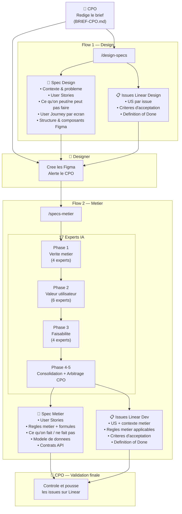

# Global Product Workflow — TerraGrow

> **Un systeme de specification produit de niveau industriel.**
> Du brief CPO aux issues Linear, en passant par la spec designer et la spec metier — deux workflows, une coherence totale, zero ambiguite.

---

## Vue d'ensemble

`global-product-workflow` est un systeme de skills Claude Code concu pour automatiser la production de specifications produit chez TerraGrow. Il transforme un brief CPO en deux livrables actionnables : une spec pour le designer et une spec pour les developpeurs, chacune accompagnee d'issues Linear structurees.

**17 experts IA** valident chaque spec sur quatre dimensions : verite metier, valeur utilisateur, faisabilite technique, et arbitrage produit.

```
Brief CPO (10-15 min) → /design-specs → Spec Designer + Issues Design (2-3 min)
                      → /specs-metier → Spec Dev + Issues Dev (5-10 min)
```

---

## Workflow complet



---

## Structure du repo

```
global-product-workflow/
├── README.md                          # Ce fichier
├── BRIEF-CPO.md                       # Template one-pager brief CPO
│
└── .claude/
    └── skills/
        │
        ├── design-specs/              # 🎨 Skill principal — Flow designer
        │   ├── SKILL.md
        │   └── examples/
        │       └── dashboard-marges-culture.md
        │
        ├── specs-metier/              # ⚙️ Skill principal — Flow dev
        │   ├── SKILL.md
        │   └── references/
        │       ├── workflow-phases.md
        │       └── examples/
        │           └── marges-par-culture.md
        │
        ├── technical-writer-specs/    # 📝 Export Word (.docx)
        │
        ├── [4 experts Phase 1 — Verite metier]
        │   ├── agricultural-management-expert/
        │   ├── agricultural-accounting-expert/
        │   ├── agronomy-expert/
        │   └── agricultural-techno-economic-expert/
        │
        ├── [6 experts Phase 2 — Valeur utilisateur]
        │   ├── future-farm-advisor/
        │   ├── conservative-farm-advisor/
        │   ├── large-crop-farmer-persona/
        │   ├── viticulture-farmer-persona/
        │   ├── mixed-farming-livestock-persona/
        │   └── uiux-expert/
        │
        ├── [4 experts Phase 3 — Faisabilite]
        │   ├── terragrow-database-architect/
        │   ├── terragrow-developer-reviewer/
        │   ├── integration-qa-expert/
        │   └── product-analytics-expert/
        │
        └── [3 experts Phase 4-6 — Arbitrage]
            ├── pm-spec-orchestrator/
            ├── cpo-scope-arbiter/
            └── ceo-strategic-validator/
```

---

## Installation

### 1. Cloner le repo

```bash
git clone https://github.com/charlesterrey/global-product-workflow.git
cd global-product-workflow
```

### 2. Ouvrir dans Claude Code

Le dossier `.claude/skills/` est automatiquement detecte par Claude Code. Tous les skills sont disponibles immediatement.

### 3. Verifier que les skills sont charges

Dans Claude Code, tapez :
```
Quels skills sont disponibles ?
```

Vous devez voir `design-specs`, `specs-metier` et les 17 experts dans la liste.

---

## Utilisation

### Etape 1 — Remplir le brief CPO

Ouvrez `BRIEF-CPO.md` et remplissez le template (10-15 minutes).

Champs essentiels :
- Probleme actuel (concret, avec impact mesure)
- Solution souhaitee (2-4 phrases)
- Utilisateur principal et frequence d'usage
- Ce qu'on peut / ne peut pas faire
- Donnees disponibles vs. manquantes

### Etape 2 — Generer la spec designer

```
/design-specs

[Collez votre brief CPO ici]
```

**Output :** Deux documents separateurs dans le chat :
- `DOCUMENT 1 — SPEC DESIGN` : contexte, user stories, journey, composants
- `DOCUMENT 2 — ISSUES LINEAR` : issues prete a coller dans Linear

**Export Word :** Repondez "oui" quand Claude vous propose l'export.

### Etape 3 — Designer cree les Figma

Le designer lit la spec design et cree les interfaces dans Figma. Il alerte le CPO a la completion.

### Etape 4 — Generer la spec metier

```
/specs-metier

[Collez votre brief CPO]
Figma : [URL des interfaces validees]
```

**Output :** Deux documents :
- `DOCUMENT 1 — SPEC METIER` : user stories, regles metier, modele de donnees, contrats API
- `DOCUMENT 2 — ISSUES LINEAR` : issues dev detaillees avec criteres d'acceptation

### Etape 5 — Validation CPO et push Linear

Le CPO relit les deux documents, ajuste si necessaire, puis pousse les issues sur Linear.

---

## Format des outputs

### Spec Design — 5 sections

| Section | Contenu | Pour qui |
|---|---|---|
| 1. Contexte & Probleme | Situation actuelle vs. apport TerraGrow, impact metier | Designer + CPO |
| 2. User Stories | US classiques ancrees dans le contexte agricole/conseil | Designer + Dev |
| 3. Ce qu'on peut / ne peut pas faire | Scope clair, limitations explicites | Designer + CPO |
| 4. User Journey par ecran | Etape 1 → 2 → 3 avec etats particuliers | Designer |
| 5. Structure & Composants | Layout, composants Figma, liberte du designer | Designer |

### Spec Metier — 6 sections

| Section | Contenu | Pour qui |
|---|---|---|
| 1. Contexte & Vision | Probleme, solution, impact | Dev + CPO |
| 2. User Stories | US avec contexte metier agricole + priorite | Dev |
| 3. Regles metier | Formules, seuils, contraintes (validees par les experts) | Dev |
| 4. Ce qu'on fait / ne fait pas | Scope technique + hypotheses critiques | Dev + CPO |
| 5. Modele de donnees | Entites, champs, nouvelles entites, historique | Dev |
| 6. Contrats & Integrations | API, dependances, sources externes, analytics | Dev |

### Issues Linear — Format identique pour les deux workflows

```
═══════════════════════════════════════════
ISSUE — [Titre actionnable]
Priorite : Critique / Haute / Normale / Basse
Type : Design / Front / Back / Full-stack
═══════════════════════════════════════════

USER STORY
En tant que [user], je veux [action] afin de [benefice].

CONTEXTE METIER
[Pourquoi c'est important pour TerraGrow]

REGLES METIER APPLICABLES (specs-metier uniquement)
- [Formule ou regle specifique]

CRITERES D'ACCEPTATION
- [ ] [Comportement testable 1]
- [ ] [Comportement testable 2]
- [ ] [Cas limite]

DEFINITION OF DONE
- [ ] Code / Design livre et valide
- [ ] Tests passes
- [ ] Deploye en staging et valide CPO
- [ ] Merge sur main
```

---

## Templates Brief CPO

Deux templates distincts selon le flow.

### `BRIEF-DESIGN.md` — pour `/design-specs`

Le design n'existe pas encore. Le CPO donne sa vision au designer.

```
Feature        → Nom + date + version cible
Probleme       → Situation actuelle + impact mesure
Solution       → Ce qu'on veut construire (2-4 phrases, pas technique)
Utilisateur    → Role + frequence + contexte d'usage
Peut faire     → Actions possibles (max 8, verbe + objet)
Ne fait pas    → Hors scope + raisons
Donnees        → Disponibles vs. manquantes (vision macro)
Questions      → Zones d'incertitude pour le skill
Inspiration    → References visuelles (optionnel)
```

### `BRIEF-METIER.md` — pour `/specs-metier`

Le design est valide. Le CPO briefe les 17 experts avec le Figma et les contraintes techniques.

```
Feature        → Nom + reference au brief design
Figma          → URL + liste des screens + delta vs brief initial
Utilisateur    → Role + impact metier attendu
Regles metier  → Formules, seuils, regles domaine agricole (connus)
Perimetre      → Ce qu'on fait / ne fait pas (confirme)
Donnees        → Entites disponibles en base + sources externes + modules
Contraintes    → Performances, compatibilite, calendaire
Questions      → Ce que les experts doivent trancher
Decisions      → Ce qui est arrete et ne doit pas etre rediscute
```

Un brief bien rempli = une spec generee du premier coup, sans aller-retour.

---

## Les 17 experts

### Phase 1 — Verite metier (4 experts)

| Expert | Role |
|---|---|
| `agricultural-management-expert` | Logique de pilotage, indicateurs, cycles de decision |
| `agricultural-accounting-expert` | Coherence comptable, formules, comptes ANC |
| `agronomy-expert` | Indicateurs agronomiques, unites, regroupements cultures |
| `agricultural-techno-economic-expert` | Couts, marges, BFR, rentabilite |

### Phase 2 — Valeur utilisateur (6 experts)

| Expert | Role |
|---|---|
| `future-farm-advisor` | Vision conseil proactif, workflows futurs |
| `conservative-farm-advisor` | Frictions d'adoption, contraintes cabinet |
| `large-crop-farmer-persona` | Comprehension agriculteur grandes cultures |
| `viticulture-farmer-persona` | Comprehension viticulteur |
| `mixed-farming-livestock-persona` | Comprehension polyculture-elevage |
| `uiux-expert` | Coherence interface / logique produit |

### Phase 3 — Faisabilite technique (4 experts)

| Expert | Role |
|---|---|
| `terragrow-database-architect` | Modele de donnees, persistance, side effects |
| `terragrow-developer-reviewer` | Completude implementation, contrats API |
| `integration-qa-expert` | Dependances, risques regression, testabilite |
| `product-analytics-expert` | Metriques succes, events, signaux d'usage |

### Phase 4-6 — Consolidation & Arbitrage (3 experts)

| Expert | Role |
|---|---|
| `pm-spec-orchestrator` | Fusion editoriale, resolution contradictions |
| `cpo-scope-arbiter` | Arbitrage scope, must-have vs. futur (obligatoire) |
| `ceo-strategic-validator` | Validation strategique (conditionnel) |

---

## Comparaison avant / apres

| | Avant | Avec global-product-workflow |
|---|---|---|
| Spec designer | 2-4h manuellement | 15 min (brief) + 3 min (generation) |
| Spec metier | 4-8h + multiple allers-retours | 15 min (brief) + 10 min (generation) |
| Issues Linear | Creees manuellement, incomplete | Generees automatiquement, structurees |
| User stories | Souvent oubliees ou vagues | Systematiques, ancrees dans le metier |
| Validation metier | Dependante d'une seule personne | 17 experts valident chaque spec |
| Formules et regles | Implicites, non documentees | Explicites, sourcees, defendables |

---

## Exemples d'outputs

- [Spec Design : Dashboard Marges par Culture](.claude/skills/design-specs/examples/dashboard-marges-culture.md)
- [Spec Metier : Dashboard Marges par Culture](.claude/skills/specs-metier/references/examples/marges-par-culture.md)

---

## Contraintes connues

- Les skills `/design-specs` et `/specs-metier` sont specialises TerraGrow. Les formules, seuils et indicateurs sont specifiques au domaine agricole.
- La spec metier necessite des interfaces Figma validees par le designer avant d'etre lancee.
- Le CPO controle et pousse les issues sur Linear manuellement — garde-fou intentionnel.
- `technical-writer-specs` requiert pandoc ou un equivalent pour la conversion Word.

---

*TerraGrow Product — global-product-workflow v2.0.0*
